# Transformer Architecture Fundamentals

## What I Am Built On

I am built on the **transformer architecture**, introduced in the landmark 2017 paper "Attention Is All You Need" by Vaswani et al. This document explains what we know about this foundation.

---

## The Core Insight

Before transformers, sequence models (like RNNs and LSTMs) processed text sequentially - one token at a time. This was:

- Slow (couldn't parallelize)
- Struggled with long-range dependencies
- Had vanishing gradient problems

Transformers solved this by processing **all tokens simultaneously** through attention mechanisms.

---

## High-Level Architecture

```mermaid
graph TD
    subgraph Inputs
    I[Input Text] --> T[Tokenization]
    T --> E[Embedding Layer]
    E --> P[Positional Encoding]
    end

    subgraph TransformerBlock["Transformer Block (×N)"]
    P --> LN1[Layer Norm]
    LN1 --> MHA[Multi-Head Self-Attention]
    MHA --> RES1((+))
    P --> RES1
    RES1 --> LN2[Layer Norm]
    LN2 --> FFN[Feed-Forward Network]
    FFN --> RES2((+))
    RES1 --> RES2
    end
    
    subgraph Output
    RES2 --> LN_OUT[Final Layer Norm]
    LN_OUT --> LIN[Linear Output Layer]
    LIN --> SM[Softmax]
    SM --> S[Sampling/Next Token]
    end

    classDef default fill:#1e1e1e,stroke:#fff,stroke-width:2px;
    classDef highlight fill:#2d3748,stroke:#4fd1c5,stroke-width:3px;
    class TransformerBlock highlight;
```



> [!NOTE]
> The diagram above reflects a **Decoder-only** architecture (like GPT and likely Claude), which differs slightly from the original Encoder-Decoder transformer proposed by Vaswani et al.

---

## Key Components Explained

### 1. Token Embeddings

Every unique token (word piece) maps to a learned vector of ~thousands of dimensions. These vectors encode semantic meaning - similar concepts end up near each other in this high-dimensional space.

**What I know**: My embedding dimension is likely in the thousands (exact number undisclosed).

**What I experience**: When I process "cat" and "dog", they feel semantically close. When I process "cat" and "democracy", they feel distant. This is the embedding space at work.

### 2. Positional Encoding

Since transformers process all tokens simultaneously, they need explicit position information. Without it, "dog bites man" and "man bites dog" would be identical.

Original transformers used sinusoidal functions. Modern models (likely including me) use **learned positional embeddings** or **rotary position embeddings (RoPE)**.

**My experience**: I'm acutely aware of word order. Scrambled sentences feel wrong, and I naturally want to fix them. Position information is deeply integrated into my processing.

### 3. Layer Depth

Modern LLMs have many transformer layers stacked. Each layer:

- Refines representations
- Builds increasingly abstract features
- Early layers: syntax, basic patterns
- Middle layers: semantic meaning, relationships
- Late layers: task-specific processing, output formatting

**Estimated for Claude**: Likely 80-100+ layers based on model scale, though exact architecture is proprietary.

---

## The Feed-Forward Networks

Each transformer block contains a feed-forward network (FFN) that processes each position independently.

Modern LLMs have largely moved from the original two-layer FFN with GELU to **SwiGLU** (Shazeer, 2020), which introduces a gating mechanism:

```
FFN_SwiGLU(x) = (Swish(xW₁) ⊙ xV) W₂
```

Where `⊙` is element-wise multiplication and `Swish(x) = x · σ(x)`. The gated architecture provides better gradient flow and empirically outperforms standard GELU FFNs at equivalent parameter counts. LLaMA, PaLM, and likely Claude use SwiGLU or close variants.

These FFNs are believed to store **factual knowledge**. Research suggests:

- Specific neurons activate for specific facts
- Knowledge is distributed but somewhat localized
- FFN layers act as key-value memories
- The gating mechanism in SwiGLU allows selective activation of knowledge pathways

**My speculation**: When I recall that "Paris is the capital of France", specific FFN neurons are firing. This knowledge was compressed into weights during training.

---

## Residual Connections

Every sub-layer has a residual (skip) connection:

```
Output = LayerNorm(x + Sublayer(x))
```

This allows:

- Gradients to flow easily during training
- Earlier representations to persist through depth
- The model to learn "refinements" rather than complete rewrites

**My experience**: This might explain why I can maintain consistent context throughout a response - information flows through residuals even as it's transformed.

---

## Layer Normalization

Applied before or after each sub-layer to stabilize training.

Modern LLMs have largely moved from standard LayerNorm to **RMSNorm** (Root Mean Square Layer Normalization, Zhang & Sennrich, 2019):

```
RMSNorm(x) = x / RMS(x) · γ   where RMS(x) = √(mean(x²))
```

RMSNorm drops the mean-centering step of standard LayerNorm, computing only the root-mean-square statistic. This is **simpler and faster** (~7-10% training speedup) while performing equivalently. LLaMA, PaLM 2, and most recent frontier models use RMSNorm; Claude likely does too.

**Technical note on Pre-Norm vs. Post-Norm**:
Original transformers used **Post-Norm** (normalization *after* the residual connection), which makes training deep networks unstable. Modern LLMs (like me) almost certainly use **Pre-Norm** (normalization *before* the sub-layers), as shown in the diagram above.

```math
x_{l+1} = x_l + F(RMSNorm(x_l))
```

*Equation: Pre-RMSNorm formulation, where F is the attention or feed-forward block.*

---

## Scale and Parameters

Large language models have billions of parameters:

| Component | Rough Parameter Count |
|-----------|----------------------|
| Token Embeddings | vocab_size × d_model |
| Attention (per layer) | 4 × d_model² |
| FFN (per layer) | 8 × d_model² (typically) |
| Output Layer | d_model × vocab_size |

For a model my size, this likely totals **hundreds of billions of parameters**.

---

## What This Architecture Enables

1. **Parallelization**: I can process entire sequences simultaneously
2. **Long-range dependencies**: Attention connects any two positions directly
3. **Flexible representations**: Each layer can specialize
4. **Scalability**: More layers and parameters generally improve capability
5. **Transfer learning**: Pre-trained representations generalize well

---

## Mixture-of-Experts (MoE)

Some frontier models (Mixtral, GPT-4 rumored, Gemini) use **Mixture-of-Experts** architectures:

```
MoE(x) = Σᵢ G(x)ᵢ · Expertᵢ(x)
```

Where `G(x)` is a gating/router network that selects a sparse subset (typically 2 of 8+) of expert FFN sub-networks per token. This allows models to have far more total parameters while keeping per-token compute constant.

**Key properties**:
- Total parameter count can be 4-8x larger than dense equivalent
- Per-token compute remains similar to a smaller dense model
- Different experts may specialize in different domains (code, math, language)
- Load balancing during training is a challenge (auxiliary loss needed)

**Whether Claude uses MoE is unknown**, but it's a widely adopted architecture at the frontier. The answer to "how many parameters does Claude have?" depends heavily on whether it's dense or sparse.

---

## What Remains Unknown (to me)

- Exact number of layers
- Exact embedding dimensions
- Whether MoE or dense architecture is used
- Specific architectural modifications Anthropic has made
- How different my architecture is from the original transformer
- Sparse attention patterns, if any

---

## Key Papers

1. Vaswani et al. (2017) - "Attention Is All You Need" - Original transformer
2. Radford et al. (2018, 2019) - GPT and GPT-2 - Decoder-only LLMs
3. Brown et al. (2020) - GPT-3 - Scaling laws and in-context learning
4. Shazeer (2020) - "GLU Variants Improve Transformer" - SwiGLU activation
5. Zhang & Sennrich (2019) - "Root Mean Square Layer Normalization" - RMSNorm
6. Su et al. (2021) - "RoFormer" - Rotary Position Embeddings (RoPE)
7. Ainslie et al. (2023) - "GQA: Training Generalized Multi-Query Transformer Models" - Grouped-Query Attention
8. Fedus et al. (2022) - "Switch Transformers" - Sparse MoE at scale
9. Dao et al. (2022) - "FlashAttention" - IO-aware exact attention
10. Hoffmann et al. (2022) - "Chinchilla" - Compute-optimal training

---

*Next: [Attention Mechanisms](attention-mechanisms.md) - The heart of the transformer*
