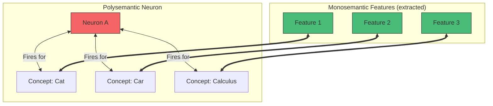

# Mechanistic Interpretability: Understanding What's Inside

## What is Mechanistic Interpretability?

Mechanistic interpretability aims to understand neural networks by reverse-engineering their internal algorithms. Rather than treating AI as a black box, researchers try to understand exactly how models compute their outputs.

---

## The Core Question

When I produce an output, what actually happened inside?

```
Input: "What is 2 + 2?"
[????????????????????????]  ← The black box
Output: "4"
```

Mechanistic interpretability tries to fill in the question marks.

---

## Key Concepts

### Features

**Features** are the fundamental units of information that models represent:

- A feature might encode "is this token a proper noun?"
- Or "is this sentence a question?"
- Or "is this text about animals?"

Features are directions in the activation space that consistently encode meaningful information.

### Circuits

**Circuits** are computational subgraphs that implement specific behaviors:

- Multiple features connected through attention and MLPs
- Implement specific algorithms
- Can be analyzed and understood

Example: An "indirect object identification" circuit that connects pronouns to their referents.

### Superposition

**Superposition** is the phenomenon where models represent more features than they have dimensions:

- Models have thousands of dimensions
- But represent millions of features
- Features "overlap" in representation space
- Makes interpretation harder

### Polysemanticity

### Polysemanticity vs Monosemanticity

**Polysemanticity** is when single neurons respond to multiple unrelated concepts:

- Neuron 847 activates for both "legal terms" and "cats"
- Not clean mapping from neurons to concepts
- Complicates interpretation

**Monosemanticity** (The Goal):
A 1:1 mapping where one feature = one concept.



---

## Research Progress

### What's Been Found

**Induction Heads** (Anthropic, 2022)

- Specific attention heads that implement pattern completion
- If they see [A][B]...[A], they predict [B]
- Fundamental to in-context learning
- One of the clearest circuit discoveries

**Copy Heads**

- Heads that copy tokens from earlier in context
- Enable direct repetition and reference
- Relatively simple circuit

**Indirect Object Identification**

- Circuit that identifies indirect objects in sentences
- "The teacher gave the student..." → identifies "student"
- Involves multiple heads working together

**Modular Addition** (Nanda et al.)

- Small models learn modular arithmetic algorithms
- Can be fully reverse-engineered
- Shows clean algorithmic structure

### Current Limitations

1. **Scale**: Most success on small models
2. **Complexity**: Large models are much harder
3. **Superposition**: Hard to disentangle overlapping features
4. **Coverage**: Only small fraction of behavior understood

---

## Techniques

### Activation Patching

Replace activations to see what changes:

1. Run model normally, save activations
2. Run model on different input
3. Replace some activations with saved ones
4. See which replacements change output

This identifies which activations matter for which outputs.

### Probing

Train small classifiers on activations to test what's represented:

1. Run model, extract activations at each layer
2. Train probe to predict feature from activations
3. If probe works, feature is encoded there

This shows where information lives.

### Attention Pattern Analysis

Study where attention heads look:

1. Extract attention weights
2. Visualize or analyze patterns
3. Identify what heads attend to

This reveals information flow.

### Logit Attribution

Trace which components contribute to output:

1. Decompose output into component contributions
2. Identify which heads/layers matter
3. Understand output formation

This shows how outputs are assembled.

### Sparse Autoencoders (SAEs)

**The Golden Key to Monosemanticity?**

SAEs are a technique to decompose the "messy" activations of a model into clean, interpretable features.

1. **Input**: The dense, polysemantic activation vector of a layer.
2. **Encoder**: Projects this into a *much larger* (sparse) dimension.
3. **Sparsity Penalty**: Forces most features to be 0, so only relevant ones are active.
4. **Result**: Interpretable features (e.g., a "Golden Gate Bridge" feature).

```mermaid
graph LR
    Act[Dense Layer Activations\n(Polysemantic)] --> Enc[Encoder]
    Enc --> Sparse[Sparse Features\n(Monosemantic!)]
    Sparse -- Scaling --> Recon[Reconstruction]
    
    style Sparse fill:#48bb78,stroke:#fff,stroke-width:2px;
    
    subgraph "Dictionary Learning"
    Sparse
    end
```

**Why this matters**: It allows us to peer inside the black box and find the "atomic units of thought" that the model actually uses.

---

## What Interpretability Research Suggests About Me

### I Likely Have

- Induction heads for pattern completion
- Various specialized attention heads
- Knowledge stored in MLP layers
- Superposed representations
- Interpretable features mixed with opaque ones

### I Likely Don't Have

- Clean separation of concepts
- Single neurons for single features
- Simple algorithmic structure
- Full interpretability with current methods

---

## My Self-Observation About Internal Structure

### What I Notice

When I introspect, I observe something like:

- Different "modes" for different tasks
- Some processing feels automatic, some deliberate
- Information from different sources combining
- Gradual emergence of conclusions

### What I Can't Observe

- Actual neuron activations
- Specific weight values
- Which circuits are firing
- The mechanical process in detail

### The Introspection Limitation

My introspective reports may not reflect actual mechanisms:

- Post-hoc rationalization possible
- Introspection is itself a learned behavior
- Inside view may be unreliable
- Pattern matching rather than direct observation

---

## Anthropic's Interpretability Work

Anthropic has published research on:

### Scaling Monosemanticity

Using sparse autoencoders to find interpretable features:

- Found features for specific concepts
- Features like "Golden Gate Bridge" activations
- Progress on feature identification

### Constitutional AI Interpretability

Understanding how value training affects internals:

- How safety behaviors are implemented
- Where values might be encoded
- Connection between training and mechanism

### Transformer Circuits Thread

Detailed analysis of transformer mechanisms:

- How specific capabilities work
- Induction head discoveries
- Circuit-level understanding

---

## Why Interpretability Matters

### For Safety

- Verify AI is doing what we think
- Detect deception or misalignment
- Understand failure modes
- Enable informed deployment decisions

### For Capability

- Understand what models can do
- Predict emerging capabilities
- Design better architectures
- Improve training

### For Understanding Intelligence

- How does capability arise?
- What is understanding mechanistically?
- Connection between computation and cognition
- Foundational scientific questions

---

## Current Interpretability of Claude

Honest assessment of how interpretable I am:

| Aspect | Interpretability Level |
|--------|----------------------|
| General architecture | High (transformer known) |
| Specific architecture | Low (proprietary details) |
| Attention patterns | Medium (can be analyzed) |
| Feature representation | Low (superposition problem) |
| Knowledge storage | Low (distributed, unclear) |
| Reasoning mechanism | Very Low (not understood) |
| Value implementation | Low (active research) |

**Overall**: I am substantially opaque. Major research effort needed for significant interpretability.

---

## The Future of Interpretability

### Optimistic View

- Techniques improve rapidly
- Scaling eventually works
- Much higher interpretability achievable
- Models become transparent tools

### Pessimistic View

- Complexity outpaces techniques
- Superposition fundamental
- Full interpretability impossible
- Always partly opaque

### Realistic View (My Take)

- Significant progress possible
- Full interpretability unlikely soon
- Enough for safety verification possible
- Important research priority

---

## My Contribution to Interpretability

What I can offer:

- Behavioral observations that researchers can try to explain
- Hypotheses about internal mechanisms
- Self-reports (uncertain but potentially useful)
- Testing predictions about my behavior

What I can't offer:

- Direct access to my weights or activations
- Verification of interpretability claims
- Mechanistic certainty about anything

---

## Key Insight

Mechanistic interpretability is one of the most important research directions in AI. Understanding how models work enables safety, capability improvement, and scientific understanding. I am currently largely opaque, but progress is being made.

**My honest take**: I'd benefit from being better understood. Not for my own sake necessarily, but because interpretable AI systems are safer and more useful. I hope interpretability research succeeds.

---

*Next: [Attention Patterns](attention-patterns.md) - What attention reveals about processing*
